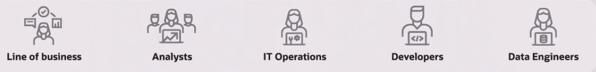

# Introduction-to-Oracle-Cloud-Essentials
Para obtener la insignia Oracle Overview

## Oracle Cloud

- Bases de datos anónimas
- MySQL Heatwave
- Para developers esta APEX, kubernetes
- Servicios de IA

Las organizaciones pueden dirigir toda su empresa en la nube de Oracle Cloud

## Quienes pueden usar los servicios de Oracle Cloud?

## Nube Distribuida

Nube publica en mas 41 países

obteniendo seguridad y escalabilidad

## Nube privada o Hybrid Cloud

- Oracle Exadata
- Cloud @Customer
- Oracle Roving EdgeInfraestructure
- OCI Observability
- Management
- Oracle Database

## Nube dedicada 

- Regiones dedicadas
- mas de 100 OCI servicios en data centers
- OCI dedicated Region
- Oracle Alloy

## Multi cloud

- Oracle Database Service for Azure
- Oracle Interconect for Azure
- Oracle MySQL HeatWave on AWS

